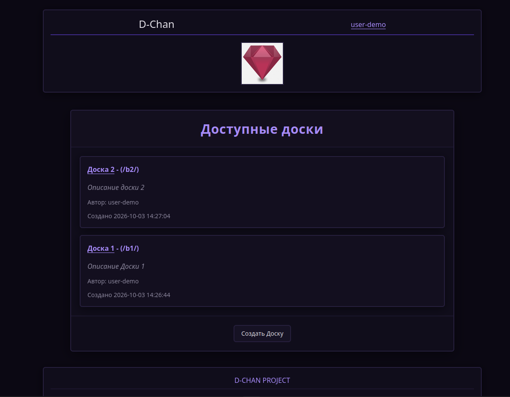
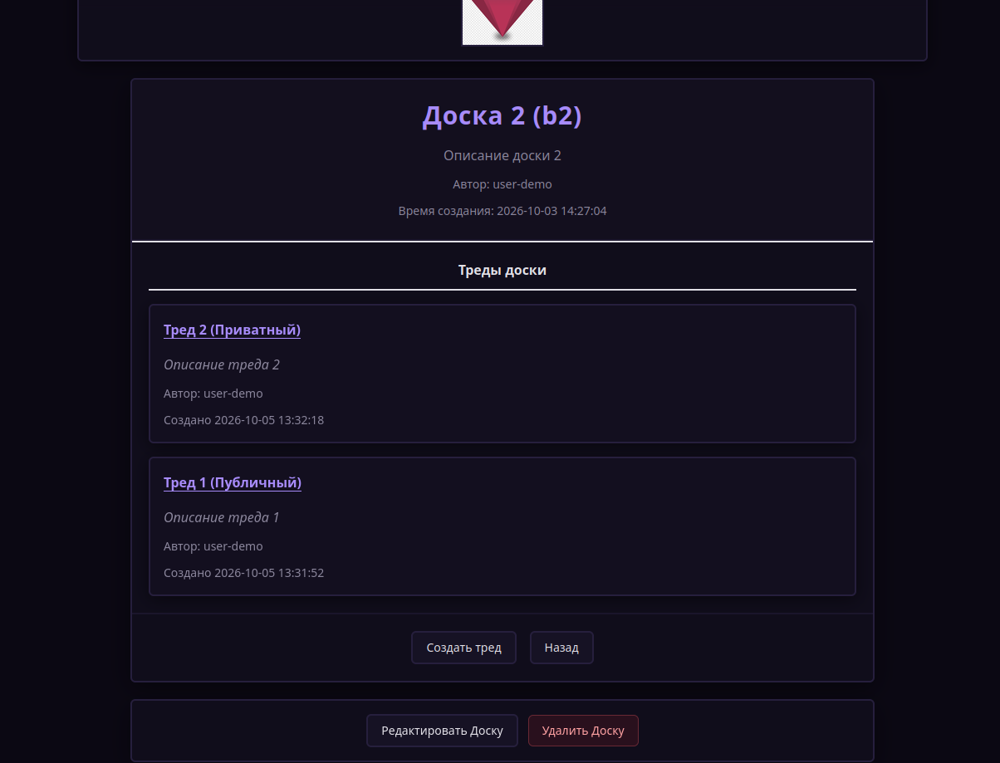
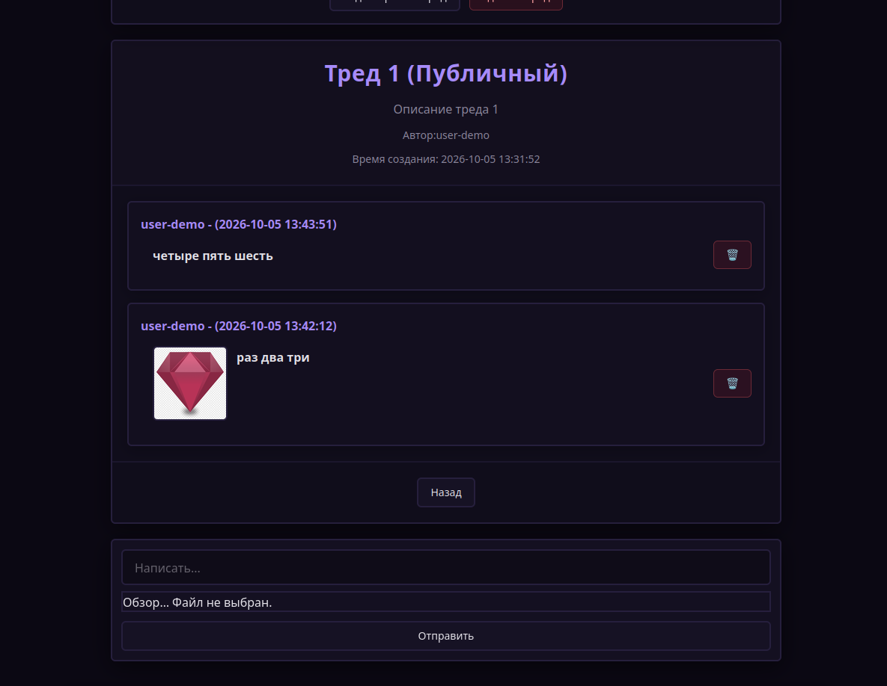
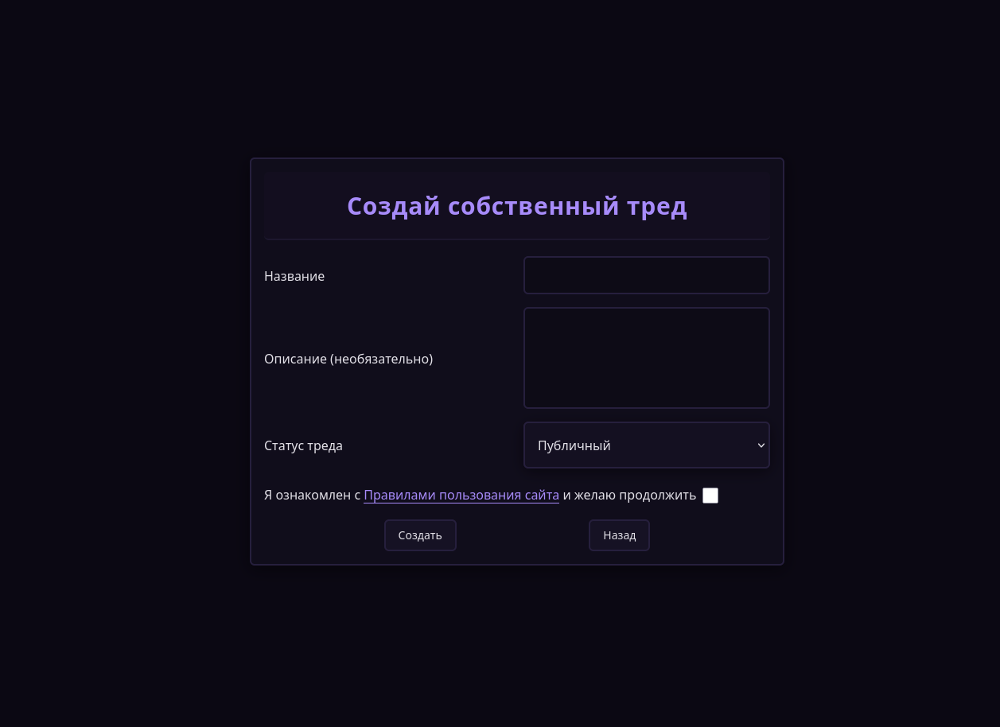

# D-CHAN

Имиджборд-проект с использованием технологии Headless CMS.  
Бэкенд — WordPress REST API + кастомные эндпоинты, фронтенд — React + TypeScript, аутентификация через JWT.

## Особенности

- Headless-архитектура: WordPress как API, React как фронтенд.
- Кастомные REST-эндпоинты для пользователей, досок, тредов и постов.
- JWT-аутентификация с токеном в `httpOnly` cookie.
- Адаптивный UI на Tailwind CSS.
- Сборка фронтенда через Webpack + Babel.
- Развёртывание через Docker (WordPress + БД).

## Скриншоты
### Список досок



### Страница доски (список тредов)



### Страница треда



### Создание треда / поста



## Стек

**Frontend:**

- React 19
- TypeScript
- Tailwind CSS 4
- Axios
- Zustand (state management)
- React Router

**Backend:**

- WordPress (PHP 8.0+)
- WordPress REST API + кастомные маршруты
- `$wpdb` для работы с БД
- JWT (firebase/php-jwt)

**Инфраструктура:**

- Docker + Docker Compose
- MySQL / MariaDB
- Node.js 22, pnpm 11

## Требования

- PHP >= 8.0
- MySQL / MariaDB (версия зависит от образа WordPress)
- Node.js >= 22
- pnpm >= 11
- Docker и Docker Compose

## Установка и запуск

### 1. Клонирование

```bash
git clone <URL-репозитория>
cd imageboard-theme
```

### 2. Настройка переменных окружения

Скопируй пример и отредактируй под себя:

```bash
cp .env.example .env
```

В `.env` укажи нужные значения. Пример для `CUSTOM_API`:

```env
# Базовый URL кастомного API
# Пример: http://localhost:8080/wp-json/myapi/v1
CUSTOM_API=http://localhost:(YOUR_PORT_NAME)/wp-json/myapi/v1
```

Замени `(YOUR_PORT_NAME)` на порт, который ты используешь в `docker-compose` для WordPress.

### 3. Запуск через Docker

В корне проекта (где лежит `docker-compose.yml`):

```bash
docker compose up -d
```

Это поднимет:

- WordPress с БД;
- тему `imageboard-theme` внутри WordPress.

### 4. Установка зависимостей фронтенда

Зайди в папку темы:

```bash
cd wp-projects/wp-content/themes/imageboard-theme
pnpm install
```

### 5. Сборка и запуск фронтенда

Для разработки:

```bash
pnpm start
pnpm tailwind
```

Для продакшена (сборка в `build/`):

```bash
pnpm build
```

После этого фронтенд будет доступен по адресу, указанному в конфиге WordPress.

## API

### Базовый URL

```text
http://localhost:(YOUR_PORT_NAME)/wp-json/myapi/v1
```

Замени `(YOUR_PORT_NAME)` на свой порт (например, `8080`).

### Эндпоинты

#### 1. Пользователи (Users)

- `POST /register` — регистрация нового пользователя.
- `POST /login` — вход (получение JWT).
- `GET /users` — получение данных пользователя.
- `PUT /users/edit` — редактирование профиля.
- `POST /users/delete` — удаление пользователя.

#### 2. Доски (Boards)

- `GET /boards` — получение информации о доске и списка тредов.
- `PUT /boards/edit` — редактирование доски.
- `POST /boards/delete` — удаление доски.
- `POST /boards/create` — создание новой доски.

#### 3. Треды (Threads)

- `GET /threads` — получение треда и постов.
- `PUT /threads/edit` — редактирование треда.
- `POST /threads/delete` — удаление треда.
- `POST /threads/create` — создание нового треда.

#### 4. Посты (Posts)

- `POST /posts/create` — создание нового поста.
- `POST /posts/delete` — удаление поста.

### Группировки ошибок (`WP_Error`)

- `server_error` — «Ошибка на стороне сервера» — код **500**.
- `missing_fields` — «Не все важные поля были заполнены» — код **400**.
- `author_not_defined` — «Пользователь не найден или не зарегистрирован» — код **401**.
- `username_taken` — «Такое имя уже занято» — код **400**.
- `board_not_found` — «Доска не найдена» — код **404**.
- `thread_not_found` — «Тред не найден» — код **404**.
- `not_defined` — «Недостоверные данные» — код **400**.
- `relative_threads_are_not_parsed` — «Не получилось достать треды, связанные с меткой (метка доски)» — код **404**.
- `nothing_to_change` — «Ничего не изменилось» — код **204**.
- `user_not_found` — «Пользователь не найден» — код **404**.
- `invalid_credentials` — «Неверный логин или пароль» — код **400**.
- `rest_forbidden` — «Вы не авторизованы» — код **401**.
- `invalid_token` — «Токен сломан или просрочен» — код **401**.
- `not_admin` — «Недостаточно прав» — код **403**.
- `error_unknown` — «Неизвестная ошибка» — код **500**.

## Структура проекта

```text
.
├── build/                 # Собранный фронтенд (игнорируется в git)
├── frontend/              # React-код фронтенда
│   ├── Pages/             # Страницы приложения
│   ├── Parts/             # Переиспользуемые компоненты
│   ├── Stores/            # Zustand-сторы
│   ├── style-presets.js   # Пресеты стилей
│   └── tailwind.css       # Основной Tailwind-файл
├── inc/                   # PHP-код темы
│   ├── callbacks/         # Callbacks для REST API
│   ├── jwt-helper.php     # Утилиты для работы с JWT
│   ├── meta.php           # Работа с мета-полями
│   ├── middlewares.php    # Middleware для REST API
│   ├── roles.php          # Роли и возможности
│   ├── routes.php         # Регистрация REST-маршрутов
│   └── widgets.php        # Виджеты (если используются)
├── public/
│   ├── pictures/          # Загруженные изображения
│   └── screenshots/       # Скриншоты для README
├── vendor/                # Composer-зависимости (игнорируется в git)
├── node_modules/          # Node-зависимости (игнорируется в git)
├── .github/
│   └── workflows/         # CI/CD (pnpm audit и т.д.)
├── .env                   # Переменные окружения
├── .env.example           # Пример переменных
├── composer.json          # PHP-зависимости
├── package.json           # Node-зависимости
├── functions.php          # Точка входа темы
├── index.php              # Главный файл темы
├── root.jsx               # Корневой React-компонент
├── webpack.config.cjs     # Конфиг Webpack
└── tsconfig.json          # Конфиг TypeScript
```

## CI / безопасность

В проекте настроен CI-пайплайн (`.github/workflows`), который включает:

- `pnpm audit` - проверка уязвимостей в Node-зависимостях.

Рекомендуется периодически запускать:

```bash
pnpm audit
composer audit
```

## Лицензия

Проект распространяется как open source без явной лицензии.  
Используй на свой страх и риск.

## Контакты

- Telegram: [@quintessencs](https://t.me/quintessencs)
- Email: [dreact61@gmail.com](mailto:dreact61@gmail.com)